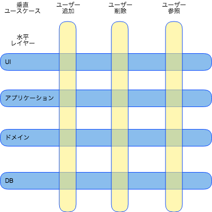

# Clean Architecture
# 定期輪読会

### Chapter.15 - 17

 

2018-10-11

@orepuri

---

## Chapter15. アーキテクチャとは?

---

  Chapter15. アーキテクチャとは?

 

## ソフトウェアアーキテクト

 

最高のプログラマ

生産性を最大化する設計にチームを導く

---

  Chapter15. アーキテクチャとは?

 

## アーキテクチャ

 

それを構築した人が与えたシステムの形状

システムをコンポーネントに分割し  
うまく配置して相互通信できるようにする

---

  Chapter15. アーキテクチャとは?

 

## アーキテクチャ

 

システムの開発, デプロイ, 運用, 保守 (ライフサイクル) を容易にする

システムの動作に影響を与えるものではない

---

  Chapter15. アーキテクチャとは?

 

## 開発

 

開発が難しいソフトウェアはライフライムが短く不健全

アーキテクチャによって開発しやすくするシステムにすべき

アーキテクチャの決定はチーム構成によって異なる

---

  Chapter15. アーキテクチャとは?

 

## デプロイ

 

システムが効果を生み出すためにデプロイ可能な状態にする

デプロイコストが高いとシステムの有用性は低下

単一のアクションで簡単にデプロイできるようにする

---

  Chapter15. アーキテクチャとは?

## 運用

 

アーキテクチャの運用への影響は他と比べ小さい

運用の課題はハードウェアの変更で解決できる  (SWコスト > HWコスト)

優れたアーキテクチャはシステムの運用方法が明確

システムの理解が容易になり, 開発や保守に役立つ

---

  Chapter15. アーキテクチャとは?

## 保守

 

最もコストがかかる (人的リソースの消費)

主なコストは洞窟探検とリスク

---

  Chapter15. アーキテクチャとは?

## 保守

 

洞窟探検 = 既存のソフトウェアを理解してどう修正するか決める

リスク = 間違った修正をして意図しない欠陥を生む

 

よいアーキテクチャはコストを大幅に低下させる

---

  Chapter15. アーキテクチャとは?

## 選択肢を残す
 

ソフトウェアの2つの価値

構造(アーキテクチャ)の価値 > 振る舞いの価値

 

ソフトウェアの柔軟性はアーキテクチャに大きく依存する

柔軟性を維持するには, できるだけ長い期間 多くの選択肢を残しておく

---

  Chapter15. アーキテクチャとは?

## 選択肢を残す
 

残すべき選択肢 = 重要でない詳細

 

ソフトウェアの2つの要素

○ 方針 = ビジネスのルールや手順(システムの価値)

✕ 詳細 = IOデバイス, DB, Web, サーバ, フレームワークなど

---

  Chapter15. アーキテクチャとは?

## 選択肢を残す
 

アーキテクトの目的は, *方針*とは無関係に詳細を決めながら *方針*を最も重要と認識するシステムの形状を作ること

---

  Chapter15. アーキテクチャとは?

## 選択肢を残す
 

詳細の決定を延期や留保することができる

適切に作るための情報が多く手に入る

 

すでに決定していたら?

優秀なアーキテクト「まだ決まってない」

---

  Chapter15. アーキテクチャとは?

## 選択肢を残した場合の例
 

デバイス非依存

ダイレクトメール

物理アドレス

---

  Chapter15. アーキテクチャとは?

## 15章 まとめ
 

アーキテクチャとはそれを構築した人が与えたシステムの形状

システムの開発, デプロイ, 運用, 保守をサポートするもの

システムの振る舞いには影響しない

 

優れたアーキテクトは方針と詳細を分離する

詳細の決定をできるだけ延期する

---

## Chapter16. 独立性

---

  Chapter16. 独立性

## アーキテクチャがサポートすべきこと
 

ユースケース

システムの運用

システムの開発

システムのデプロイ

---

  Chapter16. 独立性

## ユースケース
 

ユースケース = システムの意図

アーキテクチャはシステムの振る舞いに大きな影響を与えない

ただし, アーキテクチャレベルでシステムの意図がわかるように 振る舞いを明らかにすること

振る舞いがシステムのトップレベル要素に現れる (クラス, 関数, モジュールなど)

---

  Chapter16. 独立性

## 運用
 

システムの運用において本質的な役割を果たす

ユースケースに対してスループットや応答時間など 求められる性能をサポートしなければならない

 

そのための決定は選択肢として残しておく

適切なコンポーネントに分割しておくことで, ニーズに合わせて 複数プロセス/スレッド/マイクロサービスへ移行できる

---

  Chapter16. 独立性

## 開発
 

開発環境のサポートにおいて重要な役割を果たす

 

**コンウェイの法則**

システムを設計する組織は, 組織のコミュニケーション構造を 
コピーした構造設計を生み出す

---

  Chapter16. 独立性

## 開発
 

チームや利害関係の多い組織

システムもお互いへの干渉が強くなる

 

独立して動けるチーム

システムも独立して開発できるようになる

---

  Chapter16. 独立性

## デプロイ
 

構築後すぐにデプロイできること

そのために適切にコンポーネントに分割すること

---

  Chapter16. 独立性

## 選択肢を残す (2回目)
 

すべての懸念を解決するコンポーネント構造の バランスをとることは難しい

 

しかし, バランスをうまく取ることができる原則はある

この原則によって, システムを独立したコンポーネントに分割し 
できるだけ長時間, 多くの選択肢を残すことができる

---

  Chapter16. 独立性

## レイヤーの切り離し
 

すべてのユースケースを把握することはできないが 
システムの基本的な意図はわかっている

 

SRP(単一責任の原則)とCCP(閉鎖性共通の原則)を使用する

異なる理由で変更されるものを分離

同じ理由で変更されるものをまとめる

---

  Chapter16. 独立性

## レイヤーの切り離し
 

異なる理由で変更されるもの

UI/DB/ビジネスルールなど

 
ビジネスルールの中でも分離

アプリケーションと密接なもの(入力フィールドの検証など)

ドメインと密接なもの(口座の利益計算, 在庫計算など)

 
水平レイヤーで分離

---

  Chapter16. 独立性

## ユースケースの切り離し
 

注文入力システムに注文を追加する

注文を削除する

 

異なる頻度と理由で変更される

システムの水平レイヤーを薄く垂直にスライスする

注文入力システムに注文を追加するUIと注文を削除するUIを分離する

---

  Chapter16. 独立性

## 切り離しのイメージ

---

  Chapter16. 独立性

## 切り離し方式
 

ユースケースの分離: 高スループットと低スループットに分離可能

UI/DB/ビジネスルールの分離: 異なるサーバで実行する可能

ユースケースの切り離しは運用の役に立つ

切り離し方式も選択肢の一つ

---

  Chapter16. 独立性

## 独立した開発が可能
 

コンポーネントの明確な切り離しはチーム間の干渉を緩和する

UIチームがビジネスルールチームに影響を与えることはない

注文追加のユースケースのチームが 注文削除のユースケースのチームの邪魔はしない

---

  Chapter16. 独立性

## 独立デプロイ可能性
 

レイヤーやユースケースの切り離しはデプロイも柔軟にする

特定のレイヤーやユースケースをホットスワップすることもできる

---

  Chapter16. 独立性

## 重複
 

本物の重複: あるインスタンスに変更があれば それらのコピーも同じ変更をする必要がある

偶然の重複: 重複していたコードが異なる進化を遂げて まったく違うものになる場合

似ているというだけで重複を排除してはいけない (画面構成やアルゴリズム, DB)

本物の重複かどうか見分けること

---

  Chapter16. 独立性

## 切り離し方式(再び)
 

ソースコードレベル

あるモジュールへの変更が, 他のモジュールの変更や 再コンパイルにつながらないようにする

例: Ruby Gems

コンポーネント間の通信は関数呼び出し

---

  Chapter16. 独立性

## 切り離し方式(再び)
 

バイナリコードレベル

あるモジュールへの変更が, 他のモジュールの再ビルドや デプロイにつながらないようにする

例: Jar, DDL, 共有ライブラリ

コンポーネント間の通信は関数呼び出しもしくは プロセス間通信, ソケット, 共有メモリなど

---

  Chapter16. 独立性

## 切り離し方式(再び)
 

サービスレベル

例: マイクロサービス

コンポーネント間の通信はネットワークパケット

---

  Chapter16. 独立性

## 切り離し方式(再び)
 

プロジェクト初期の段階で判断するのは難しい

プロジェクトのライフサイクルによって最適な方式もかわる

---

  Chapter16. 独立性

## 切り離し方式(再び)
 

作者おすすめの方法

 

サービスレベルの分離ができそうなところまでコンポーネントを分離

分離はするが, 実際はソースコードレベルまでにしておく

開発/デプロイ/運用の問題が多くなれば デプロイやサービスレベルに変更する

状況に応じて変更できるようにすること(戻すことも含む)

---

  Chapter16. 独立性

## 16章 まとめ
 

システムの切り離し方式は時間とともに変化する

優秀なアーキテクトはそうした変化を予見して適切に進める

---

## Chapter17. バウンダリー: 境界線を引く

---

  Chapter17. バウンダリー: 境界線を引く

## バウンダリー

 

ソフトウェアアーキテクチャとは境界線を引く技芸

ソフトウェアの要素を分離し, お互いがわからないように制限する

---

  Chapter17. バウンダリー: 境界線を引く

## アーキテクチャの目的を妨げるもの
 

結合

特に早すぎる決定との結合

 

早すぎる決定 = システムのビジネス要件と関係ない決定

フレームワーク/DB/Webサーバ/ユーティリティライブラリ/DI, etc

---

  Chapter17. バウンダリー: 境界線を引く

## 実例

悲しい結合の物語

高度なアーキテクチャを早く導入しすぎて失敗した話

 

NetNesse

DBの決定を遅らせることで成功した話

 

---

  Chapter17. バウンダリー: 境界線を引く

## あなたの境界線は何か? いつ境界線を引くのか?
 

「重要なもの」と「重要でないもの」の間

ビジネスルールとUI

ビジネスルールとDB

UIとDB

---

  Chapter17. バウンダリー: 境界線を引く

## あなたの境界線は何か?  いつ境界線を引くのか?
 

データベースはビジネスルールにとって重要ではない

ビジネスルールが知る必要があるのはデータの永続化の機能が あるということだけ

永続化がどう実装されているかは重要ではない

---

  Chapter17. バウンダリー: 境界線を引く

## 入力と出力
 

IOは無関係の原則

 

UIはビジネスルールに依存するが, ビジネスルールはUIに依存しない

重要なのはビジネスルール

---

  Chapter17. バウンダリー: 境界線を引く

## プラグインアーキテクチャ
 

他のコンポーネントを追加するパターン

UIやDBはプラグインとして置き換え可能

---

  Chapter17. バウンダリー: 境界線を引く

## プラグインの戦い
 

ReSharper vs Visual Studio

RsSharperがVisual Studioに依存しているため Visual StudioテームはReShaperを無効化できる

逆はできない

---

  Chapter17. バウンダリー: 境界線を引く

## プラグインの戦い
 

境界線は変更の軸があるところに引く

境界線を挟んだコンポーネントはそれぞれの変更頻度や理由が違う

UIとビジネスルールは異なる時間や頻度で変更される

---

  Chapter17. バウンダリー: 境界線を引く

## 17章 まとめ
 

境界線を引くにはまずコンポーネントに分割する

どれかがコアのビジネスルールのコンポーネントになる

コアのビジネスに直接関係しないコンポーネント（UIやDB）は プラグインにしておく

これはDIPとSAPを適用したもの(詳細=実装が抽象に依存)になる
